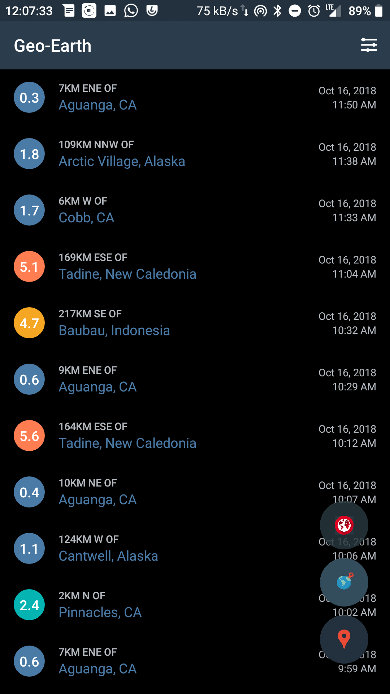
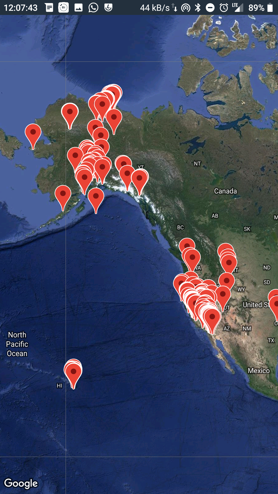
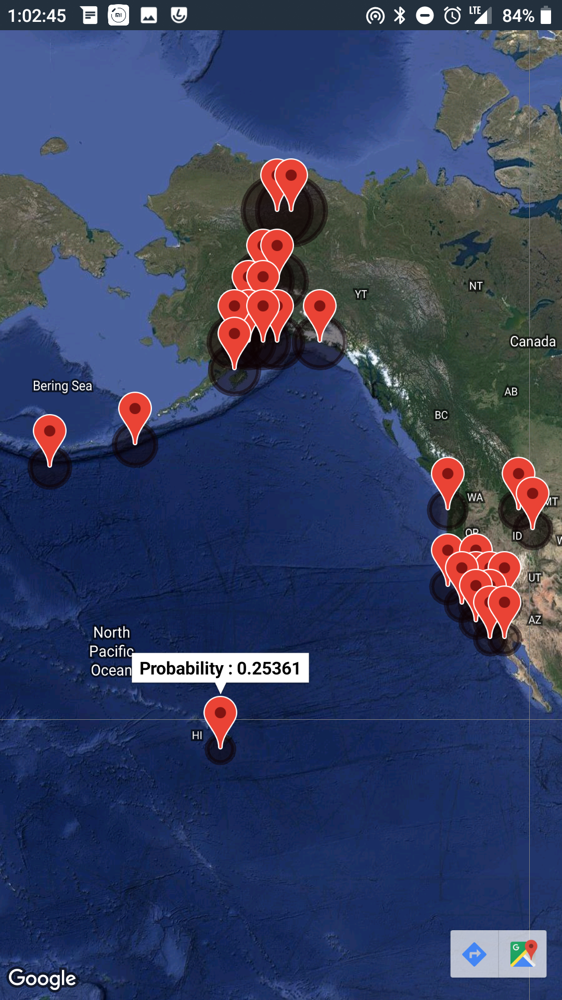
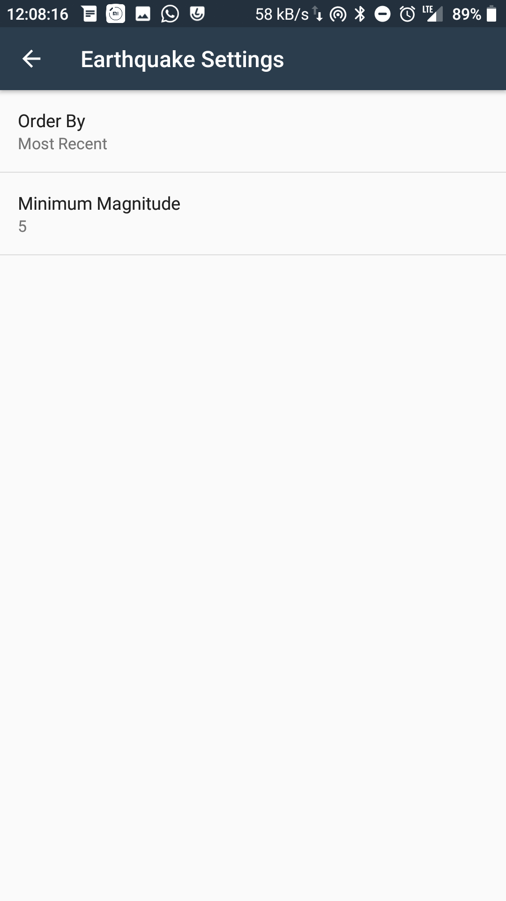

Geo Earth App
===================================

This app is an extenstion of the app built in Udacity Android Course

This app displays a list of recent earthquakes in the world
from the U.S. Geological Survey (USGS) organization.

Pre-requisites
--------------

- Android SDK v23
- Android Build Tools v23.0.2
- Android Support Repository v23.3.0

Getting Started
---------------

This sample uses the Gradle build system. To build this project, use the
"gradlew build" command or use "Import Project" in Android Studio.

Make sure you update your Google Maps Developer Key in the App manifest.

Using The App
-------

If there are no Earthquakes showing, check the minimum magnitude to show in App Preferences

First Floating button allows you to gather earthquake data from a specific region

  -Tap on a desired region on the map and the app will fetch the earthquakes in that region
  
Second Floating button will visualize all the earthquakes currently displaying on the Map using Google Maps API

Third Floating button will analyze the current earthquakes and will predict the most likely regions in which earthquake can occur with a probability.

Screenshots
---------

